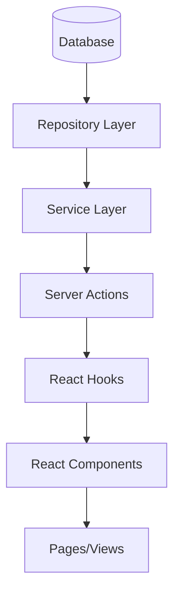

## ryoa - roll your own authentication -
_Showcasing you that rollin' your own auth is not that hard._

We also rolled our own analytics in here 😉

The main application runs on a postgres database via drizzle-orm. For the analytics I opted for a seperate database being libsql (turso).

A modern, type-safe, and modular application architecture built with Next.js, focusing on clean separation of concerns and maintainable code structure.

## 🏗️ Architecture Overview

The application follows a layered architecture pattern with clear boundaries between different concerns:



### Core Concepts

1. **Type Safety**: Extensive use of TypeScript with strict type checking
2. **Modular Design**: Feature-based module organization
3. **Clean Architecture**: Clear separation between data, business logic, and presentation
4. **Functional Approach**: Emphasis on functional programming patterns

## 📁 Project Structure

```
src/
├── api/
│   ├── db/              # Database configuration and migrations
│   └── queries/         # Global API queries
├── modules/             # Feature modules
│   ├── authenticatie/   # Authentication module
│   ├── notifications/   # Notifications module
│   └── workspaces/     # Workspaces module
├── shared/             # Shared utilities and components
│   ├── components/     # Shared UI components
│   ├── types/         # Common type definitions
│   └── utilities/     # Shared utilities
└── app/               # Next.js app router pages
```

## 🔄 Data Flow

### 1. Database Layer
- Uses Drizzle ORM for type-safe database operations
- Tables defined using Drizzle's schema builder
- Strong typing for all database operations

### 2. Repository Layer
```typescript
// Example repository pattern
export function notificationRepository() {
  return {
    async findByUserId(userId: UUID, options: TGetNotificationsOptions): Promise<TNotification[]>,
    async create(data: TCreateNotificationInput): Promise<TNotification>,
    // ... other methods
  };
}
```

### 3. Service Layer
```typescript
// Example service layer
export const notificationService = {
  async createNotification(data: TCreateNotificationInput): Promise<TNotificationWithActor>,
  async getUserNotifications(userId: UUID, options): Promise<TNotificationWithActor[]>,
  // ... other methods
};
```

### 4. Server Actions
```typescript
// Example server action
export async function getUserNotifications(options: TGetNotificationsOptions) {
  const session = await getSession();
  return await notificationService.getUserNotifications(session.userId, options);
}
```

### 5. React Hooks
```typescript
// Example hook
export function useNotifications(initialOptions: TGetNotificationsOptions) {
  const [notifications, setNotifications] = useState<TNotificationWithActor[]>([]);
  // ... implementation
}
```

## 🔑 Core Types

### Base Types

```typescript
// UUID Type for strong ID typing
export type UUID = string & { readonly _brand: unique symbol };

// Base Entity Type
export interface TBaseEntity {
  id: UUID;
  createdAt: Date;
  updatedAt: Date;
}

// Base Response Types
export interface TBaseMutationResponse<T> {
  success: boolean;
  data?: T;
  error?: string;
}
```

### Module-Specific Types

Each module defines its own types that extend from base types:

```typescript
export interface TNotification extends TBaseEntity {
  userId: UUID;
  type: TNotificationType;
  title: string;
  message: string;
  // ... other properties
}
```

## 🔐 Authentication Flow

1. User authentication through email/password or OAuth providers
2. Session management using JWT tokens
3. Role-based access control (RBAC)
4. Protected routes and API endpoints

## 🎯 Key Features

### Modular Architecture
- Each module is self-contained with its own:
  - Repository layer
  - Service layer
  - Server actions
  - React hooks
  - Components

### Type Safety
- Strict TypeScript configuration
- Type inference from database to UI
- Custom type utilities and guards

### Performance Optimizations
- Efficient data fetching
- Proper caching strategies
- Optimized bundle splitting

### Development Experience
- Clear separation of concerns
- Consistent patterns across modules
- Strong type safety
- Functional programming approach

## 🛠️ Technical Stack

- **Framework**: Next.js
- **Language**: TypeScript
- **Database**: PostgreSQL
- **ORM**: Drizzle
- **State Management**: React Hooks + Context
- **UI Components**: Custom components + Shadcn
- **Styling**: Tailwind CSS
- **Authentication**: Custom JWT implementation
